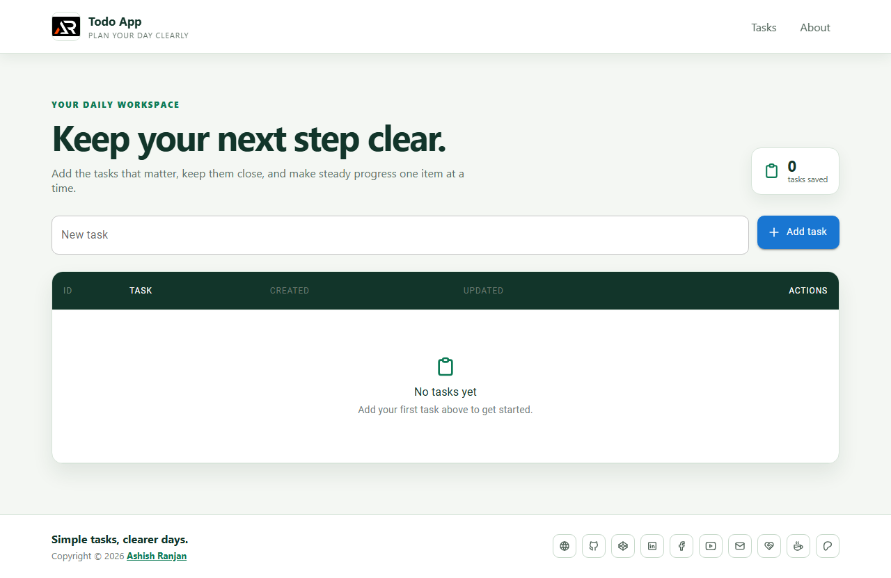

# Todo App



Todo App is a responsive React task manager for capturing daily work, editing tasks, deleting completed items, and keeping the list available after refresh.

## Features

- Add, edit, delete, and review tasks
- Local browser storage for saved tasks
- Responsive table layout with mobile navigation
- Fixed header with logo, scroll-aware visibility, and keyboard-friendly controls
- Accessible icon-only footer links and floating go-to-top button

## Tech stack

- React and Create React App
- Material UI
- SCSS modules
- React Icons
- React Toastify and SweetAlert2

## Getting started

```bash
npm install
npm start
```

Create a production build with `npm run build`. Deploy to GitHub Pages with `npm run deploy`.

## Future prospects

Future improvements could include task priorities, due dates, filters, categories, and optional account-based sync.

## Deployment

[https://a2rp.github.io/todo-app/](https://a2rp.github.io/todo-app/)

## Links

- Portfolio: [https://www.ashishranjan.net](https://www.ashishranjan.net)
- GitHub: [https://github.com/a2rp](https://github.com/a2rp)
- CodePen: [https://codepen.io/ash1198](https://codepen.io/ash1198)
- LinkedIn: [https://www.linkedin.com/in/aashishranjan](https://www.linkedin.com/in/aashishranjan)
- Facebook: [https://www.facebook.com/theash.ashish/](https://www.facebook.com/theash.ashish/)
- YouTube: [https://www.youtube.com/@ashishranjan-ashz?sub_confirmation=1](https://www.youtube.com/@ashishranjan-ashz?sub_confirmation=1)
- Email: [ash.ranjan09@gmail.com](mailto:ash.ranjan09@gmail.com)

## Support

- Support: [https://a2rp-donation-page.netlify.app/](https://a2rp-donation-page.netlify.app/)
- Buy Me a Coffee: [https://buymeacoffee.com/a2rp](https://buymeacoffee.com/a2rp)
- Patreon: [https://www.patreon.com/a2rp](https://www.patreon.com/a2rp)
